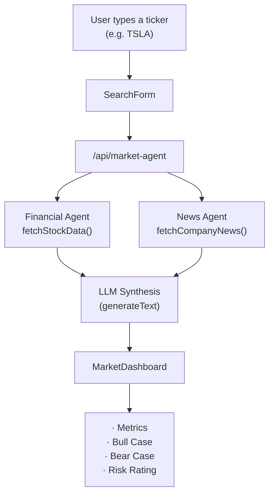

<div align="center">

<pre>
   ███╗   ███╗ █████╗ ██████╗ ██╗  ██╗███████╗████████╗     ██╗      ██████╗  ██████╗ ███╗   ███╗
   ████╗ ████║██╔══██╗██╔══██╗██║ ██╔╝██╔════╝╚══██╔══╝     ██║     ██╔═══██╗██╔═══██╗████╗ ████║
   ██╔████╔██║███████║██████╔╝█████╔╝ █████╗     ██║        ██║     ██║   ██║██║   ██║██╔████╔██║
   ██║╚██╔╝██║██╔══██║██╔══██╗██╔═██╗ ██╔══╝     ██║        ██║     ██║   ██║██║   ██║██║╚██╔╝██║
   ██║ ╚═╝ ██║██║  ██║██║  ██║██║  ██╗███████╗   ██║        ███████╗╚██████╔╝╚██████╔╝██║ ╚═╝ ██║
   ╚═╝     ╚═╝╚═╝  ╚═╝╚═╝  ╚═╝╚═╝  ╚═╝╚══════╝   ╚═╝        ╚══════╝ ╚═════╝  ╚═════╝ ╚═╝     ╚═╝
</pre>

### One Search. Complete Market Intelligence.

MarketLoom is an autonomous **Market & Competitor Intelligence Agent** that weaves live
quantitative financial data together with real-time qualitative news sentiment, then has
an LLM synthesize both into a single, structured Bull vs. Bear market briefing in seconds.

[](https://market-loom-v2.vercel.app/)
[](./LICENSE)
[](https://skillsbuild.org)

[](#-tech-stack)
[](#-tech-stack)
[](#-tech-stack)
[](#-tech-stack)
[](#-tech-stack)
[](#tech-stack)

[Overview](#overview) ·
[Features](#features) ·
[How It Works](#how-it-works) ·
[Architecture](#architecture) ·
[Tech Stack](#tech-stack) ·
[Getting Started](#getting-started) ·
[Project Structure](#project-structure) ·
[Usage](#usage) ·
[Roadmap](#roadmap) ·
[Team](#team) ·

</div>

---

##  Overview

Researching a stock today means bouncing between a finance site for fundamentals and a
news feed for sentiment, then manually deciding whether the two stories agree. **MarketLoom
closes that gap.** Type a ticker or company name, and two specialist agents go to work in
parallel - one pulling quantitative fundamentals, the other pulling qualitative news - before
an LLM orchestrator fuses both into one structured briefing: key metrics, a risk rating, and
a side-by-side Bull Case vs. Bear Case.

No dashboards to piece together yourself. One search, one synthesized answer.

---

## Features

- **Ticker or Company Search** - Search using a stock ticker (`TSLA`) or company name (`Tesla`).
- **Financial Agent** - Retrieves live price, market cap, P/E ratio, 52-week high/low, and other key metrics.
- **News Agent** - Fetches recent news headlines and analyzes market sentiment.
- **LLM Synthesis Layer** - Combines outputs from both agents into a structured market briefing using the Vercel AI SDK.
- **Bull vs. Bear Analysis** - Presents balanced investment arguments for every search.
- **Risk Rating** - Provides a color-coded Low, Medium, or High risk assessment.
- **Quick Ticker Shortcuts** - One-click access to popular stocks like NVDA, TSLA, AAPL, MSFT, and AMZN.
- **Responsive Dashboard** - Modern, dark-themed interface built with Tailwind CSS.

---

##  How It Works



The Financial and News agents run concurrently, and their combined output is handed to an
LLM that returns a single structured JSON payload the dashboard renders directly.

---

## Architecture

MarketLoom is a **stateless, serverless 2-agent pipeline** - no database, deployed entirely
on Vercel's edge network.

```

┌───────────────────────────┐
│       SearchForm          │
│  (components/)            │
│  • Ticker input           │
│  • Popular ticker chips   │
└─────────────┬─────────────┘
              │
              ▼
┌───────────────────────────┐
│    Agent Orchestrator     │
│  (app/api/market-agent/)  │
│  • Calls both agent tools │
│  • Synthesizes via LLM    │
└──────┬───────────────┬────┘
       │               │
       ▼               ▼
┌──────────────┐  ┌──────────────┐
│ Finance Tool │  │  News Tool   │
│(lib/tools/)  │  │(lib/tools/)  │
│ Stock metrics│  │  Headlines & │
│ P/E, mkt cap │  │  sentiment   │
└──────────────┘  └──────────────┘
              │
              ▼
┌───────────────────────────┐
│     MarketDashboard       │
│  (components/)            │
│  • Metrics grid           │
│  • Bull vs. Bear cards    │
│  • Risk badge & news feed │
└───────────────────────────┘

```

- **SearchForm owns input** - capturing what the user wants analyzed
- **Agent Orchestrator owns reasoning** - running both tools and synthesizing the result
- **Finance & News tools own data** - each is an isolated, independently testable fetcher
- **MarketDashboard owns output** - rendering the synthesized briefing

---

## Tech Stack

| Layer | Technology |
|---|---|
| **Framework** | Next.js 14 (App Router) |
| **Language** | TypeScript |
| **Styling** | Tailwind CSS, lucide-react |
| **AI Orchestration** | Vercel AI SDK (`generateText`) |
| **LLM Provider** | OpenAI |
| **Data Sources** | Yahoo Finance (financials), live web/news search |
| **Deployment** | Vercel (serverless, edge-first) |

---

## Project Structure

```
MarketLoom/
├── app/
│   ├── page.tsx                  # Main layout, search + dashboard state
│   └── api/
│       └── market-agent/
│           └── route.ts          # Agent orchestrator (finance + news → LLM synthesis)
├── components/
│   ├── SearchForm.tsx            # Ticker input, shortcuts, loading state
│   └── MarketDashboard.tsx       # Metrics grid, Bull/Bear cards, risk badge, news feed
├── lib/
│   └── tools/
│       ├── finance-tool.ts       # fetchStockData() - quantitative metrics
│       └── news-tool.ts          # fetchCompanyNews() - headlines & sentiment
├── public/
├── .env.local                    # OPENAI_API_KEY (not committed)
└── README.md
```

---

## Getting Started

### Prerequisites

- **Node.js** 18+ and npm
- An **OpenAI API key**
- **Git**

### Clone the repo

```bash
git clone https://github.com/calsify/MarketLoom.git
cd MarketLoom
```

### Install & configure

```bash
npm install
```

Create a `.env.local` file at the project root:

```
OPENAI_API_KEY=sk-proj-your-openai-key-here
```

### Run locally

```bash
npm run dev
```

Open [http://localhost:3000](http://localhost:3000) to see MarketLoom running.

---

## Usage

1. Type a ticker (`TSLA`) or company name (`Tesla`) into the search bar - or click one of
   the popular ticker shortcuts (`NVDA`, `TSLA`, `AAPL`, `MSFT`, `AMZN`)
2. Hit **Analyze** (or press Enter)
3. The Financial Agent and News Agent fetch data in parallel
4. The LLM synthesizes both into one briefing
5. Read the metrics grid, risk rating, Bull vs. Bear cases, and recent news signals

---

## Contributing / Git Workflow

To keep merges conflict-free, each module lives in its own file and branch no one edits outside their assigned path.

|  | Branch | File Owned |
|---|---|---|
| 1 | `feature/member-1-core` | `app/page.tsx` |
| 2 | `feature/member-2-finance-tool` | `lib/tools/finance-tool.ts` |
| 3 | `feature/member-3-news-tool` | `lib/tools/news-tool.ts` |
| 4 | `feature/member-4-agent-orchestrator` | `app/api/market-agent/route.ts` |
| 5 | `feature/member-5-search-ui` | `components/SearchForm.tsx` |
| 6 | `feature/member-6-dashboard-ui` | `components/MarketDashboard.tsx` |


---

## Roadmap

- [ ] Real-time price streaming
- [ ] Portfolio-level multi-ticker analysis
- [ ] Historical sentiment trend charts
- [ ] Export briefing as PDF
- [ ] Watchlists & saved searches

---

## Team

| Module | Team Member | GitHub | LinkedIn | Responsibilities |
|--------|-------------|--------|----------|------------------|
| 🧠 Core & Integration | **Avanish** | [](#) | [](#) | Repo setup, `app/page.tsx` layout, state management, PR approvals |
| 📊 Financial Agent | **Gyanendra** | [](#) | [](#) | `lib/tools/finance-tool.ts` - stock price & valuation ratio fetcher |
| 📰 News Agent | **Akshata** | [](https://github.com/akshatabasankar) | [](https://linkedin.com/in/akshata-basankar/) | `lib/tools/news-tool.ts` - web search & news headline fetcher |
| 🧩 Agent Orchestrator | **Shashwat** | [](https://github.com/shashwat230710) | [](https://linkedin.com/in/shashwat-shukla23/) | `app/api/market-agent/route.ts` - multi-agent API route via Vercel AI SDK |
| 🔍 Search UI | **Mobashshir** | [](https://github.com/Mobasheera) | [](https://linkedin.com/in/mobashshir-ahsan/) | `components/SearchForm.tsx` - search bar, ticker shortcuts, loading states |
| 📈 Dashboard UI | **Nikhil** | [](https://github.com/nikzzzzzzzzzz) | [](https://www.linkedin.com/in/nikhilkanojiya/) | `components/MarketDashboard.tsx` - metrics cards, Bull/Bear cards, risk badges |

---

## 📜 License

This project is licensed under the [MIT License](./LICENSE) - free to use for educational, research, and hackathon purposes.

---
